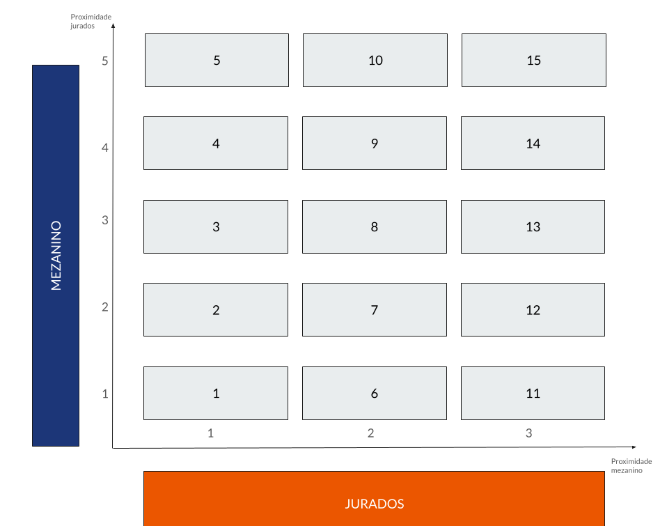

# K Means Clustering with Masterchef Brasil Data
**Languages**: SQL and Python

Performed clustering analysis to group contestants based on performance metrics, identifying patterns and similarities among participants.

- SQL Database Creation & Management: Built a SQL database to store and manage Masterchef Brasil 2023 data. Conducted data queries and preprocessing using SQL with mysql-connector in Python.
- Data Preprocessing: Cleaned and prepared the dataset, including handling missing values and normalizing data, to ensure it was ready for clustering analysis.
- Exploratory Data Analysis (EDA): Conducted EDA to understand the distribution of performance metrics and identify potential patterns among contestants.
- Clustering Techniques: Applied K-Means clustering to group contestants into distinct clusters based on their performance, using the elbow method to determine the optimal number of clusters.
- Data Visualization: Visualized clustering results using scatter plots and cluster centroids, making it easier to interpret and present the insights gained from the analysis.
- Interpretation of Results: Analyzed the characteristics of each cluster to understand common traits among contestants and their relationship to overall competition outcomes.

